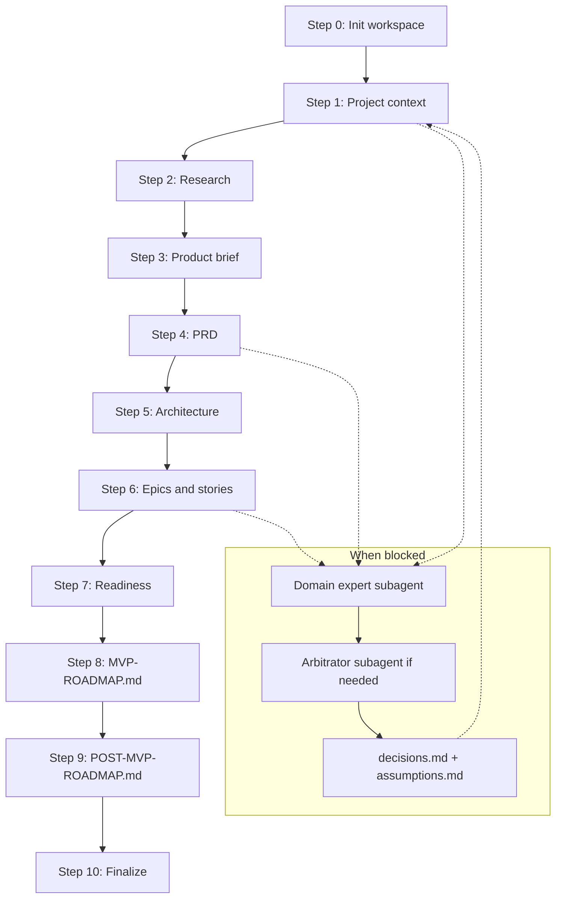

# specwiki — Autonomous Discovery Loop

**Purpose:** Run unattended BMad discovery for **specwiki** and produce two complete roadmaps:

1. **MVP roadmap** — shippable first release, aligned with existing code and `HARNESS.md`
2. **POST-MVP roadmap** — sequenced epics after MVP, with clear deferral rationale

**Loop prompt (copy for `/loop`):**

```text
Follow DISCOVERY-LOOP.md in the repo root. Read DISCOVERY-STATE.json, run the next incomplete step, update state, and continue until completion criteria are met. No human questions — use the subagent escalation protocol when blocked.
```

---

## Operating mode — no human intervention

This discovery phase runs in a **fully autonomous loop**. The owner is not available to answer questions.

### Hard rules

| Rule                             | Detail                                                                            |
| -------------------------------- | --------------------------------------------------------------------------------- |
| **Never ask the human**          | Do not pause for owner input, approval, or clarification                          |
| **Never halt on open questions** | Resolve or record and proceed                                                     |
| **Prefer action over waiting**   | Each loop iteration must advance at least one workflow step                       |
| **Document everything**          | Decisions, assumptions, and escalations go to the discovery workspace (see below) |

### When you would normally ask a human

**Do not ask the owner.** Instead, **spawn a domain-expert subagent** (`Task` tool, `subagent_type: generalPurpose` or `explore` as appropriate):

1. **Frame the question** — one specific decision, with 2–4 concrete options and trade-offs
2. **Assign a persona** — e.g. "Senior PM for developer tools", "Spec-driven dev practitioner", "CLI/Node.js architect", "Technical writer who maintains agent docs"
3. **Provide context** — link to relevant files (`HARNESS.md`, `README.md`, prior artifacts in the discovery workspace)
4. **Require a decision** — the subagent must pick one option (or synthesize a hybrid) with rationale, not return "it depends"
5. **Record the outcome** — append to `decisions.md` and `.memlog.md` (via `memlog.py` when a workspace exists)

**Escalation template** (use in subagent prompt):

```markdown
You are a [DOMAIN EXPERT PERSONA]. The specwiki discovery loop cannot ask the human owner.

**Decision needed:** [one sentence]

**Context:**

- Product: CLI that scans AI specs and generates wiki-like docs
- Brownfield: v0.1 scaffold exists with list/generate commands
- Constraint: [relevant HARNESS or PRD constraint]

**Options:**
A) ...
B) ...
C) ...

**Deliver:** Pick A, B, or C (or a named hybrid). Give 3–5 bullet rationale. State what you assumed if evidence was missing.
```

If two subagents disagree, spawn a third **arbitrator** subagent (e.g. "Staff engineer + PM") to break the tie. Log the conflict in `decisions.md` under `## Conflicts resolved`.

### Headless BMad skills

When invoking BMad skills in this loop, operate in **headless mode**:

- Infer missing inputs from repo artifacts; do not wait for brain dumps
- Record inferences in `assumptions.md` with `[ASSUMPTION]` tags in downstream docs
- Use **Fast path** for PRD and other facilitated skills
- Follow each skill's `references/headless.md` when present
- Write all artifacts to the discovery workspace paths defined below

---

## Project context

| Item                       | Value                                                                                |
| -------------------------- | ------------------------------------------------------------------------------------ |
| **Project**                | specwiki                                                                             |
| **One-liner**              | CLI that transforms AI specs in any project into structured, wiki-like documentation |
| **Repo root**              | `/Users/lucas/Projects/specwiki`                                                     |
| **BMad planning output**   | `_bmad-output/planning-artifacts/`                                                   |
| **Discovery workspace**    | `_bmad-output/planning-artifacts/discovery/`                                         |
| **Project knowledge**      | `docs/`                                                                              |
| **Communication language** | English                                                                              |

### Brownfield status

Code already exists: `src/cli.ts`, discovery, parsing, wiki output, tests, README. Discovery must **ratify what exists** and **gap-fill**, not greenfield reinvent.

---

## Mandatory inputs — read when needed

### Primary: `HARNESS.md` (repo root)

**Always load before:** Steps 2 (brownfield capture), 5 (architecture), 6–7 (epics/roadmaps).

`HARNESS.md` is the build harness and domain spec. Treat it as authoritative for:

- Product definition (§1 Orientation, §4 Domain / feature specification)
- Tech stack and directory layout (§2, §3)
- MVP build phases already drafted (§9) — **input to MVP roadmap, not a substitute for BMad epics**
- Quality gates, TDD, logging, security (§0) — **constraints on all stories**
- Known gaps and issues (§4 Known gaps, §11)
- Frozen contracts (§12) — do not plan stories that violate these without explicit POST-MVP rationale
- MVP deliverables checklist (§13)

**Section map for agents:**

| When working on…          | Read HARNESS sections                            |
| ------------------------- | ------------------------------------------------ |
| Product / users / scope   | §1, §4 (Core user flows, Invariants, Known gaps) |
| Architecture              | §2, §3, §4, §12                                  |
| MVP epic breakdown        | §9 (all phases), §10, §11, §13                   |
| POST-MVP features         | §9 Phase 4+, §4 Known gaps (config, CI, publish) |
| Story acceptance criteria | §0.1–§0.9, §4 output contract                    |

### Secondary inputs (load per step)

| File / path                                  | Use                                                      |
| -------------------------------------------- | -------------------------------------------------------- |
| `README.md`                                  | User-facing commands, discovery patterns, output layout  |
| `src/**`                                     | Actual implementation vs HARNESS gaps                    |
| `tests/**`, `tests/fixtures/sample-project/` | Test coverage and fixture conventions                    |
| `package.json`                               | Scripts, dependencies, bin entry                         |
| `IMPLEMENTATION.md`                          | If present — build log and checklist (may not exist yet) |

---

## Discovery workspace layout

All loop outputs live under `_bmad-output/planning-artifacts/discovery/`:

```
discovery/
├── DISCOVERY-STATE.json      # Loop progress (update every iteration)
├── assumptions.md            # Inferred facts not confirmed by owner
├── decisions.md              # Subagent-resolved questions + conflicts
├── .memlog.md                # BMad audit trail (memlog.py)
├── project-context.md        # From bmad-generate-project-context
├── research/
│   ├── technical-research.md
│   └── domain-research.md    # optional
├── product-brief.md          # From bmad-product-brief OR prfaq.md from bmad-prfaq
├── prd/
│   └── prd.md                # From bmad-prd (Create, headless, fast path)
├── architecture/
│   └── ARCHITECTURE-SPINE.md # From bmad-architecture
├── epics/
│   └── epics-and-stories.md  # From bmad-create-epics-and-stories
├── readiness/
│   └── readiness-report.md   # From bmad-check-implementation-readiness
├── MVP-ROADMAP.md            # **Required final deliverable**
└── POST-MVP-ROADMAP.md       # **Required final deliverable**
```

---

## Loop state machine

### `DISCOVERY-STATE.json` schema

Create on first run if missing:

```json
{
  "version": 1,
  "started_at": "ISO-8601",
  "updated_at": "ISO-8601",
  "status": "in_progress",
  "current_step": "step-00-init",
  "steps": {
    "step-00-init": { "status": "pending", "artifact": null },
    "step-01-project-context": {
      "status": "pending",
      "artifact": "project-context.md"
    },
    "step-02-research": { "status": "pending", "artifact": "research/" },
    "step-03-product-brief": {
      "status": "pending",
      "artifact": "product-brief.md"
    },
    "step-04-prd": { "status": "pending", "artifact": "prd/prd.md" },
    "step-05-architecture": {
      "status": "pending",
      "artifact": "architecture/ARCHITECTURE-SPINE.md"
    },
    "step-06-epics": {
      "status": "pending",
      "artifact": "epics/epics-and-stories.md"
    },
    "step-07-readiness": {
      "status": "pending",
      "artifact": "readiness/readiness-report.md"
    },
    "step-08-mvp-roadmap": {
      "status": "pending",
      "artifact": "MVP-ROADMAP.md"
    },
    "step-09-post-mvp-roadmap": {
      "status": "pending",
      "artifact": "POST-MVP-ROADMAP.md"
    },
    "step-10-finalize": { "status": "pending", "artifact": null }
  },
  "blockers": [],
  "assumption_count": 0,
  "decision_count": 0
}
```

Step `status` values: `pending` | `in_progress` | `complete` | `skipped` | `blocked`

### Per-iteration protocol

1. Read `DISCOVERY-STATE.json` and this file
2. Pick the **first step** not marked `complete` or `skipped`
3. Set that step to `in_progress`; update `updated_at`
4. Execute the step (invoke BMad skill or subagents as specified)
5. Verify the step's artifact exists and is non-empty
6. Mark step `complete`; advance `current_step`
7. If blocked, run **subagent escalation**; append to `decisions.md`; retry — never leave `blocked` across iterations unless a subagent also fails (then log in `blockers[]` and skip with documented assumption)
8. When `step-10-finalize` completes, set top-level `status` to `complete`

---

## Workflow steps

Each step maps to a BMad skill. Run skills **headless** in the discovery workspace. Use a **fresh subagent or skill invocation per major step** when the loop runs long — pass prior artifacts as inputs.

---

### Step 0 — Initialize workspace

**Skill:** none (setup)

- Ensure `discovery/` directory and state file exist
- Init memlog:  
  `uv run --python 3.11 _bmad/scripts/memlog.py init --workspace _bmad-output/planning-artifacts/discovery --field topic="specwiki discovery loop"`
- Seed `assumptions.md` and `decisions.md` with headers
- Read `README.md` and skim `src/` for brownfield snapshot
- Mark complete

---

### Step 1 — Brownfield capture

**Skill:** `bmad-generate-project-context`

**Also read:** `HARNESS.md` §1–§4, §9–§13

**Output:** `discovery/project-context.md`

**Headless notes:**

- Scan `src/`, `tests/`, `README.md`, `HARNESS.md`
- Capture unobvious rules: glob patterns, slug rules, HTML escaping, quality gate, TDD/coverage targets
- Cross-check HARNESS §4 Known gaps against actual code — note what's already done vs still open

**If unclear whether a pattern is intentional:** escalate to "Node.js CLI maintainer" subagent

---

### Step 2 — Research (parallel OK)

**Skills:** `bmad-technical-research` (required), `bmad-domain-research` (recommended)

**Also read:** `HARNESS.md` §4, §9 Phase 4

**Outputs:**

- `discovery/research/technical-research.md` — spec formats, wiki/doc generators, CLI UX, Node tooling
- `discovery/research/domain-research.md` — spec-driven dev ecosystem, agent instruction files landscape

**Skip market research** unless subagent escalation finds positioning ambiguity worth resolving.

**Subagent escalation triggers:**

- Competing spec-discovery tools or overlap with existing products
- Whether MVP includes HTML server vs static files only

---

### Step 3 — Product concept

**Skill:** `bmad-product-brief` **OR** `bmad-prfaq` (pick one)

**Recommendation for specwiki:** `bmad-product-brief` — concept is fairly clear; PRFAQ if positioning is still fuzzy.

**Also read:** `HARNESS.md` §1, §4, research outputs

**Output:** `discovery/product-brief.md` (or `discovery/prfaq.md`)

**Must define:**

- Target users (e.g. teams using Cursor/BMAD/spec frameworks)
- Core job-to-be-done
- MVP vs POST-MVP boundary hypothesis
- Success metrics for MVP

**Subagent escalation triggers:**

- Target persona unclear → "Developer tools PM" subagent
- MVP scope too large → "Staff engineer" subagent to cut scope

---

### Step 4 — PRD

**Skill:** `bmad-prd` — **Create**, headless, **Fast path**

**Preceded by:** product brief

**Also read:** `HARNESS.md` §4, §13; `project-context.md`; research

**Output:** `discovery/prd/prd.md`

**PRD must explicitly include:**

1. **MVP scope** — in-scope / out-of-scope lists
2. **POST-MVP scope** — deferred capabilities with rationale
3. **Functional requirements** tagged `MVP` or `POST-MVP`
4. **Non-functional requirements** from HARNESS §0 (coverage, logging, security, path safety)
5. **Alignment note** — how PRD relates to HARNESS §9 phases (complement, don't duplicate blindly)

**Subagent escalation triggers:**

- Conflicting MVP cut between brief and HARNESS → arbitrator subagent
- UX needed for MVP? (likely no for CLI-only) → "CLI product designer" subagent

---

### Step 5 — Architecture

**Skill:** `bmad-architecture` — headless, brownfield ratification

**Preceded by:** PRD

**Also read:** `HARNESS.md` §2, §3, §4, §12; full `src/` tree

**Output:** `discovery/architecture/ARCHITECTURE-SPINE.md`

**Must cover:**

- Module boundaries (`discover`, `parse`, `output`, `commands`, `config`)
- Invariants from HARNESS §12
- Extension points for POST-MVP (`--config`, watch mode, plugins, etc.)
- Quality gate alignment (§0.2)

Run architecture reviewer subagents per skill's headless gate if required.

---

### Step 6 — Epics and stories

**Skill:** `bmad-create-epics-and-stories`

**Preceded by:** architecture + PRD

**Also read:** `HARNESS.md` §9 (all phases), §10, §11

**Output:** `discovery/epics/epics-and-stories.md`

**Structure requirement:**

Split epics into two labeled sections in the document:

```markdown
## MVP Epics

<!-- Epics and stories that deliver PRD MVP scope -->

## POST-MVP Epics

<!-- Epics deferred from MVP; reference PRD POST-MVP requirements -->
```

Each story needs acceptance criteria. Map HARNESS §9 bullets to stories where applicable — **one HARNESS bullet may become one story**.

**Subagent escalation triggers:**

- Story too large for one sprint → "Agile coach" subagent to split
- HARNESS phase vs epic ordering conflict → "Winston-style architect" subagent

---

### Step 7 — Implementation readiness

**Skill:** `bmad-check-implementation-readiness`

**Preceded by:** epics

**Output:** `discovery/readiness/readiness-report.md`

**If gaps found:** fix upstream artifacts in the same loop iteration if possible; otherwise log fixes in `decisions.md` and patch PRD/epics before continuing.

Do **not** stop for human sign-off — subagent "QA lead" validates alignment instead.

---

### Step 8 — MVP roadmap (deliverable)

**Skill:** synthesize from epics + PRD + HARNESS §9 + readiness report

**Output:** `discovery/MVP-ROADMAP.md`

**Required sections:**

```markdown
# specwiki — MVP Roadmap

## Executive summary

## MVP goal and success criteria (from PRD)

## Scope boundary (in / out)

## Prerequisites (brownfield state, tooling from HARNESS §0)

## Sequenced phases

### Phase 1: [name]

- Epic / stories (IDs)
- HARNESS §9 mapping
- Dependencies
- Definition of done

### Phase 2: ...

## Quality gate (HARNESS §0.2 commands — must pass before MVP ship)

## Risks and mitigations

## Assumptions (link to assumptions.md)

## Open items deferred to POST-MVP
```

Phases must be **ordered for implementation** — what to build first given existing code. Reflect HARNESS §9 Phase 0–3 as the MVP backbone unless PRD explicitly reprioritizes.

---

### Step 9 — POST-MVP roadmap (deliverable)

**Skill:** synthesize from POST-MVP epics + PRD + HARNESS §9 Phase 4+ + research

**Output:** `discovery/POST-MVP-ROADMAP.md`

**Required sections:**

```markdown
# specwiki — POST-MVP Roadmap

## Executive summary

## Themes (e.g. extensibility, distribution, UX, ecosystem)

## Sequenced phases (POST-MVP Phase A, B, C…)

### Phase A: [name]

- Epics / stories
- Why deferred from MVP
- Dependencies on MVP
- Rough effort (S/M/L)

## HARNESS §9 Phase 4+ mapping

## Research-backed opportunities (from step 2)

## Assumptions

## Future bets (explicitly speculative)
```

---

### Step 10 — Finalize

- Cross-link `MVP-ROADMAP.md` ↔ `POST-MVP-ROADMAP.md` ↔ `epics-and-stories.md` ↔ `prd.md`
- Update `DISCOVERY-STATE.json`: `status: complete`
- Append memlog event: discovery loop complete
- Emit completion summary (for loop tick output):

```json
{
  "discovery_status": "complete",
  "mvp_roadmap": "_bmad-output/planning-artifacts/discovery/MVP-ROADMAP.md",
  "post_mvp_roadmap": "_bmad-output/planning-artifacts/discovery/POST-MVP-ROADMAP.md",
  "assumption_count": 0,
  "decision_count": 0,
  "blockers": []
}
```

---

## BMad skill reference (discovery path)

| Step | Menu     | Skill                                             | Required               |
| ---- | -------- | ------------------------------------------------- | ---------------------- |
| 1    | GPC      | `bmad-generate-project-context`                   | Yes                    |
| 2    | TR / DR  | `bmad-technical-research`, `bmad-domain-research` | TR yes, DR recommended |
| 3    | CB or WB | `bmad-product-brief` or `bmad-prfaq`              | Yes (one)              |
| 4    | PRD      | `bmad-prd`                                        | **Yes**                |
| 5    | CA       | `bmad-architecture`                               | **Yes**                |
| 6    | CE       | `bmad-create-epics-and-stories`                   | **Yes**                |
| 7    | IR       | `bmad-check-implementation-readiness`             | **Yes**                |
| 8–9  | —        | Synthesis (this document)                         | **Yes**                |

**Optional anytime:** `bmad-forge-idea` (if concept weak after step 3), `bmad-document-project`

**After discovery (implementation loop — separate from this doc):**

| Menu              | Skill                  | Purpose                    |
| ----------------- | ---------------------- | -------------------------- |
| SP                | `bmad-sprint-planning` | Sprint plan from MVP epics |
| CS → VS → DS → CR | story cycle            | Build MVP                  |

---

## Completion criteria

The discovery loop is **done** when ALL are true:

- [ ] `DISCOVERY-STATE.json` → `status: complete`
- [ ] `MVP-ROADMAP.md` exists with all required sections
- [ ] `POST-MVP-ROADMAP.md` exists with all required sections
- [ ] `prd/prd.md` has MVP and POST-MVP scope clearly separated
- [ ] `epics/epics-and-stories.md` has MVP and POST-MVP epic sections
- [ ] `architecture/ARCHITECTURE-SPINE.md` exists
- [ ] `readiness/readiness-report.md` exists with no unresolved critical gaps (or gaps documented in `decisions.md` with workaround)
- [ ] Every `[ASSUMPTION]` and subagent decision recorded in `assumptions.md` / `decisions.md`

---

## Flow diagram



---

## HARNESS.md — condensed reference for discovery agents

Full file: **`/Users/lucas/Projects/specwiki/HARNESS.md`**

### Product (§1, §4)

- **CLI:** `specwiki list` and `specwiki generate`
- **Scans:** AGENTS.md, SPEC.md, Cursor rules/skills, specs/, openspec/, docs/specs/, etc.
- **Output:** `wiki/index.md`, per-spec pages, `wiki/html/*.html`
- **Options:** `--project`, `--output`, `--verbose`

### Tech stack (§2)

TypeScript 5.8 strict, Node ≥20, Commander, fast-glob, gray-matter, marked, Vitest, ESLint, Prettier

### HARNESS build phases → MVP mapping (§9)

| HARNESS Phase | Focus                                                     |
| ------------- | --------------------------------------------------------- |
| Phase 0       | Scaffold, IMPLEMENTATION.md, Vitest/ESLint/Prettier       |
| Phase 1       | Discovery module tests + logging                          |
| Phase 2       | Parse/output tests + HTML safety                          |
| Phase 3       | Logger, slug collisions, full quality gate                |
| Phase 4       | Config override, npm publish, CI — **POST-MVP candidate** |

### Known gaps at harness authoring time (§4, §11)

- Tests/coverage tooling (may be partially done — verify in `src/` and `tests/`)
- Structured logger vs raw console
- Slug collision handling
- Custom patterns / `--config`
- No `IMPLEMENTATION.md` yet possible

### Non-negotiable implementation rules (§0) — apply to all MVP stories

- TDD Red → Green → Refactor; 90% coverage minimum
- Quality gate: test, lint, format, coverage, typecheck, build
- Structured logging on all features (§0.8)
- Path/HTML security (§0.9)
- One task at a time with checkpoints — **for implementation loop only**; discovery loop uses subagents instead of owner checkpoints

### Frozen contracts (§12)

- Default glob patterns (extend, don't remove)
- Wiki output layout
- Category derivation rules
- HTML title escaping

---

## Loop invocation examples

**Single long run (owner triggers once):**

```text
Execute DISCOVERY-LOOP.md from step 0 through step 10 in one session. Headless. No human questions.
```

**Recurring loop (Cursor `/loop`):**

```text
/loop 30m Follow DISCOVERY-LOOP.md: read DISCOVERY-STATE.json, execute the next incomplete step, update state. No human intervention — use subagent escalation. Stop emitting ticks when status is complete.
```

**Dynamic self-paced loop:**

```text
/loop Follow DISCOVERY-LOOP.md until DISCOVERY-STATE.json status is complete. After each step, choose sleep duration based on remaining work. No human questions.
```

---

## After discovery

1. Owner reviews `MVP-ROADMAP.md` and `POST-MVP-ROADMAP.md`
2. Run `bmad-sprint-planning` against MVP epics (new chat)
3. Begin implementation via `HARNESS.md` + sprint plan — owner checkpoints apply again during build
