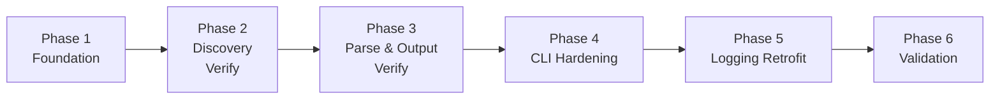

# specwiki — MVP Roadmap

**Status:** Final  
**Created:** 2026-07-12  
**Sources:** [prd/prd.md](prd/prd.md), [epics/epics-and-stories.md](epics/epics-and-stories.md), [readiness/readiness-report.md](readiness/readiness-report.md), [architecture/ARCHITECTURE-SPINE.md](architecture/ARCHITECTURE-SPINE.md), [project-context.md](project-context.md), `HARNESS.md` §0–§4, §9–§13

---

## Executive summary

specwiki v0.1 already implements the full `list` → `generate` pipeline with 15 passing tests and ~99% line coverage. MVP completion is **hardening and meta**, not greenfield architecture. Five implementation gaps block sign-off: `IMPLEMENTATION.md`, structured logger (`src/core/Logger.ts`), slug collision disambiguation, list zero-match tip parity, and path-traversal guard tests.

This roadmap sequences six phases that respect brownfield reality: verify existing Phase 0–2 work, build Phase 3 hardening (logger + slug fix) before retrofitting logging into discover/parse/output modules, then close with dogfood validation and HARNESS §13 sign-off. Total scope: **6 MVP epics (E1–E6), 24 stories**, aligned to HARNESS Phases 0–3.

**Estimated remaining effort:** ~8–12 owner-reviewed tasks (one HARNESS bullet each), concentrated in E1 S1.1, E5 S5.1–S5.5, E6 S6.1–S6.4, plus logging retrofit S2.4/S4.4.

---

## MVP goal and success criteria (from PRD)

### Goal

Deliver a zero-config local CLI that discovers AI agent specs across a repository and synthesizes them into a categorized, browsable wiki (markdown + HTML) — hardened to production quality with structured logging, slug safety, and 90% test coverage.

**Primary persona:** Solo Cursor/AI agent developer ("Alex") who needs to understand scattered agent instructions in under 60 seconds without grep or re-prompting.

### Success criteria

| Criterion | Target | Verification |
| --------- | ------ | ------------ |
| Time to first wiki | < 60 seconds from clone to browsable output | `specwiki generate` on `tests/fixtures/sample-project/` |
| Discovery yield | ≥ 5 spec files on fixture tree (actual: 10) | `specwiki list` on fixture |
| Zero-config rate | ≥ 80% of BMAD/OpenSpec/Cursor sample repos need no custom patterns | Fixture coverage in `tests/fixtures/` |
| Quality gate reliability | 100% pass on full §0.2 gate | All six npm scripts green |
| Coverage threshold | ≥ 90% lines/functions/branches/statements | `npm run coverage` |
| Slug integrity | Zero silent overwrites from path collisions | S5.4 collision tests |
| Structured logging | Verbose-gated events on discover/parse/output/CLI paths | `src/core/Logger.ts` wired |
| Build traceability | `IMPLEMENTATION.md` complete through Phase 3 | E1 S1.1 + S5.5 log row |
| HARNESS §13 checklist | All items pass | E6 S6.4 audit |

**MVP proves:** A zero-config `specwiki generate` run produces a complete wiki from a brownfield repo without requiring a docs platform, team infrastructure, or framework migration.

---

## Scope boundary (in / out)

### In scope (MVP = HARNESS Phases 0–3)

| Area | Capability |
| ---- | ---------- |
| Discovery | 15+ default glob patterns; category/title derivation; `specwiki list` grouped output |
| Synthesis | `specwiki generate` — discover → parse → write wiki |
| Markdown wiki | `wiki/index.md` + `wiki/{slug}.md` per spec |
| HTML wiki | `wiki/html/*.html` with title escaping |
| CLI flags | `--project`, `--output`, `--verbose` |
| Hardening | Structured logger; slug collision disambiguation; path traversal safety |
| Quality | Vitest 90% thresholds; full §0.2 quality gate |
| Build log | `IMPLEMENTATION.md` through Phase 3 |
| Validation | Dogfood on `tests/fixtures/sample-project/` (10 specs) |

### Out of scope (POST-MVP = HARNESS Phase 4+)

| Area | Rationale |
| ---- | --------- |
| `--patterns` / `specwiki.config.js` | Zero-config MVP must prove defaults first (FR-005) |
| npm publish / `npx specwiki` | Distribution after hardening stable (FR-027) |
| CI workflow (GitHub Actions) | Package-level gate; POST-MVP Phase 4.3 (FR-028) |
| `specwiki serve` | Static HTML browsable directly; decision 2026-07-12 |
| `generate --watch` / `--check` | Manual re-run sufficient for Persona A |
| `--json` machine output | Agent consumers POST-MVP (FR-023) |
| `wiki/llms.txt` export | High value, not required to prove synthesis |
| Extended discovery (`_bmad-output/**`, nested `AGENTS.md`) | Default patterns sufficient for Persona A (FR-006) |
| Semantic parsing (BMAD kernels, OpenSpec deltas) | All inputs treated as markdown-with-frontmatter |
| E2E / browser tests | HARNESS §0.2.1 default skip |

---

## Prerequisites (brownfield state, tooling from HARNESS §0)

### Brownfield state (v0.1.0 — authoritative per `project-context.md`)

**Already implemented:**

| Component | Status | Evidence |
| --------- | ------ | -------- |
| `specwiki list` / `generate` | Working | `src/cli.ts`, `src/commands/generate.ts` |
| Discovery module | Working | `src/discover/specs.ts` — 15+ patterns, category/title derivation |
| Parse module | Working | `src/parse/markdown.ts` — frontmatter, sections, marked render |
| Output module | Working | `src/output/wiki.ts` — md + HTML dual output, `escapeHtml` |
| Test suite | 15/15 pass, ~99% line coverage | `tests/` mirrors `src/` |
| Quality gate scripts | Present | `package.json`: test, lint, format, coverage, typecheck, build |
| Fixture tree | 10 specs, 8 categories | `tests/fixtures/sample-project/` |

**Remaining gaps (MVP blockers):**

| Gap | Story | HARNESS ref |
| --- | ----- | ----------- |
| `IMPLEMENTATION.md` missing | S1.1 | Phase 0.1 |
| `src/core/Logger.ts` missing | S5.1 | Phase 3.1 |
| Slug collision disambiguation missing | S5.4 | Phase 3.4, §11 #1 |
| Raw `console.log` verbose logging | S5.2, S2.4, S4.4 | Phase 3.2, 1.4, 2.6 |
| List zero-match tip missing | S6.1 | FR-004 |
| Path traversal guard tests thin | S4.3 | Phase 2.5 |
| Exit code 2 for usage errors | S6.2 | FR-022 [ASSUMPTION] |

### Tooling prerequisites (HARNESS §0 — already satisfied)

| Requirement | Source | Status |
| ----------- | ------ | ------ |
| TypeScript 5.8 strict, Node ≥ 20 | §2 | ✓ |
| Vitest + @vitest/coverage-v8 | §0.1 | ✓ — 90% thresholds enforced |
| ESLint 9 + Prettier 3 | §0.2 | ✓ |
| TDD workflow (Red → Green → Refactor) | §0.1 | ✓ — established in existing tests |
| Quality gate scripts | §0.2 | ✓ — all six commands pass today |
| `tests/fixtures/sample-project/` | §10 | ✓ — AGENTS.md, Cursor rules/skills, OpenSpec |

**Note:** HARNESS §4 "Known gaps" listing "no tests" and "no lint" is stale. `project-context.md` is authoritative.

### Implementation discipline (applies to every task)

- **One bullet = one task = one commit** (HARNESS §9)
- Full §0.2 quality gate after every task
- Owner checkpoint after every task (HARNESS §0.3) — resumes when owner authorizes implementation
- `IMPLEMENTATION.md` build log update after every task (HARNESS §0.4)

---

## Sequenced phases

Phases are ordered for brownfield implementation: verify existing work first, build Logger before logging retrofit, fix slug collisions before sign-off, validate last.



---

### Phase 1: Foundation & Build Tracking

**Epic:** E1 — Project Scaffold & Build Infrastructure  
**Stories:** S1.1, S1.2, S1.3, S1.4  
**HARNESS §9 mapping:** Phase 0 (0.1–0.4)

**Brownfield note:** S1.2–S1.4 are largely complete (Vitest, ESLint, Prettier, test layout, quality gate scripts all exist and pass). **S1.1 is the primary remaining work** — create `IMPLEMENTATION.md` as the first implementation task.

| Story | HARNESS | Status | Action |
| ----- | ------- | ------ | ------ |
| S1.1 | 0.1 | **Pending** | Create `IMPLEMENTATION.md` with checklist, build log, status header |
| S1.2 | 0.2 | **Done** | Verify Vitest/ESLint/Prettier configs; no changes expected |
| S1.3 | 0.3 | **Done** | Verify all six gate scripts pass |
| S1.4 | 0.4 | **Done** | Verify `tests/` mirror layout and fixture tree |

**Dependencies:** None — start here.

**Definition of done:**

- [ ] `IMPLEMENTATION.md` exists with HARNESS Phases 0–3 progression checklist and build log table
- [ ] Seed build log row documents discovery-loop artifact creation
- [ ] `npm run typecheck` and `npm run build` pass
- [ ] Test runner executes (15+ tests passing)
- [ ] Document references HARNESS §0 workflow

**Phase gate:** `IMPLEMENTATION.md` exists; tooling verified green.

---

### Phase 2: Discovery Module Verification

**Epic:** E2 — Discovery Module Hardening  
**Stories:** S2.1, S2.2, S2.3 (S2.4 deferred to Phase 5)  
**HARNESS §9 mapping:** Phase 1 (1.1–1.3); logging bullet 1.4 deferred

**Brownfield note:** Discovery tests exist in `tests/discover/specs.test.ts`. Phase 2 is **verification and gap-fill**, not greenfield. S2.4 (structured logging in discover) requires `Logger.ts` from Phase 4 — do not block on it here.

| Story | HARNESS | FR | Status | Action |
| ----- | ------- | -- | ------ | ------ |
| S2.1 | 1.1 | FR-002 | **Likely done** | Verify `deriveCategory` coverage ≥ 90%; add edge-case tests if branch coverage below threshold (currently 87.5%) |
| S2.2 | 1.2 | FR-002 | **Likely done** | Verify `deriveTitle` special cases (SKILL, AGENTS, SPEC, CLAUDE, GEMINI) |
| S2.3 | 1.3 | FR-001, FR-003 | **Likely done** | Verify fixture discovers ≥ 5 specs (actual: 10); `list` groups by category |
| S2.4 | 1.4 | FR-021 | **Deferred** | → Phase 5 after S5.1 |

**Dependencies:** Phase 1 complete (`IMPLEMENTATION.md` exists for logging tasks).

**Definition of done:**

- [ ] `deriveCategory` and `deriveTitle` coverage ≥ 90% on all metrics
- [ ] `discoverSpecs` integration test passes against `tests/fixtures/sample-project/` (10 files, 8 categories)
- [ ] `specwiki list` behaviour unchanged — grouped output sorted by category then path
- [ ] `DEFAULT_SPEC_PATTERNS` frozen (extend-only per NFR-013)
- [ ] Quality gate passes

**Phase gate:** Discovery module ≥ 90% coverage; `specwiki list` behaviour unchanged.

---

### Phase 3: Parse & Output Module Verification

**Epics:** E3 — Parsing Module Hardening, E4 — Wiki Output Hardening  
**Stories:** S3.1, S3.2, S4.1, S4.2, S4.3 (S4.4 deferred to Phase 5)  
**HARNESS §9 mapping:** Phase 2 (2.1–2.5); logging bullet 2.6 deferred

**Brownfield note:** Parse and output tests exist across `tests/parse/`, `tests/output/`, `tests/commands/`. HTML title escaping is tested and passes. **S4.3 path traversal tests need strengthening** per readiness report.

| Story | HARNESS | FR | Status | Action |
| ----- | ------- | -- | ------ | ------ |
| S3.1 | 2.1 | FR-008 | **Likely done** | Verify section/description extraction tests |
| S3.2 | 2.2 | FR-007, FR-009 | **Likely done** | Verify frontmatter variants and raw body preservation |
| S4.1 | 2.3 | FR-011–FR-013 | **Likely done** | Verify slug, page, index builders |
| S4.2 | 2.4 | FR-015 | **Likely done** | Verify `escapeHtml` / `wrapHtml` malicious title tests |
| S4.3 | 2.5 | FR-011, FR-015, NFR-008 | **Verify** | Add/strengthen path traversal tests (`..` segments, output confinement) |
| S4.4 | 2.6 | FR-021 | **Deferred** | → Phase 5 after S5.1 |

**Dependencies:** Phase 2 complete (shared discovery contract stable).

**Definition of done:**

- [ ] Parse module coverage ≥ 90% on all metrics
- [ ] Output module coverage ≥ 90% (branch coverage in `wiki.ts` currently 82.6% — add tests if below threshold after S4.3)
- [ ] Generated wiki matches README output contract (`index.md`, `{slug}.md`, `html/` subtree)
- [ ] Path traversal guard tests assert writes confined to resolved output directory
- [ ] HTML title escaping verified for malicious input
- [ ] Quality gate passes

**Phase gate:** Parse + output modules ≥ 90% coverage; generated wiki matches README contract.

---

### Phase 4: CLI Hardening & MVP Blockers

**Epic:** E5 — CLI Commands, Logger & MVP Hardening  
**Stories:** S5.1, S5.2, S5.3, S5.4, S5.5  
**HARNESS §9 mapping:** Phase 3 (3.1–3.5)

**Brownfield note:** This phase contains the **three MVP blockers** identified in readiness: Logger, slug collisions, and full quality gate confirmation. Commands work today but use raw `console.log` for verbose output.

| Story | HARNESS | FR | Priority | Summary |
| ----- | ------- | -- | -------- | ------- |
| S5.1 | 3.1 | FR-021, NFR-006 | **Blocker** | Extract `src/core/Logger.ts` — verbose-gated `log.info`/`log.error` |
| S5.2 | 3.2 | FR-021 | **Blocker** | Wire Logger through `commands/generate.ts`; remove raw console verbose paths |
| S5.3 | 3.3 | FR-003, FR-004, FR-016, FR-019–FR-022 | High | Command-level tests with mocked I/O |
| S5.4 | 3.4 | FR-014 | **Blocker** | Slug collision disambiguation (fixes HARNESS §11 #1) |
| S5.5 | 3.5 | NFR-001, NFR-004 | High | Full §0.2 quality gate pass; repo-wide coverage confirmation |

**Implementation order within phase:**

1. **S5.1** — Logger module (unblocks Phase 5 logging retrofit)
2. **S5.2** — Wire logger through commands
3. **S5.4** — Slug collision fix (independent of logger; can parallelize with S5.2)
4. **S5.3** — Command tests (benefits from S5.2 and S5.4 behaviour)
5. **S5.5** — Final gate confirmation

**Dependencies:** Phases 2–3 verified (modules stable for hardening).

**Definition of done:**

- [ ] `src/core/Logger.ts` exists with verbose-gated `log.info` and always-on `log.error`
- [ ] `commands/generate.ts` uses Logger; `cli.command` and `cli.error` events emitted
- [ ] Slug collisions disambiguated — no silent last-write-wins (test with colliding paths)
- [ ] Command tests cover list zero-match, generate summary, flag defaults, exit codes
- [ ] All §0.2 commands pass in sequence; repo-wide coverage ≥ 90%
- [ ] `IMPLEMENTATION.md` build log updated with Phase 3 completion row
- [ ] README commands verified manually on fixture project

**Phase gate:** All §0.2 commands pass; coverage ≥ 90% repo-wide; slug collisions fixed; Logger wired in commands.

---

### Phase 5: Cross-Module Logging Retrofit

**Epic:** E2 S2.4 + E4 S4.4 (cross-cutting)  
**Stories:** S2.4, S4.4  
**HARNESS §9 mapping:** Phase 1.4, Phase 2.6 (retrofit after Phase 3.1)

**Rationale:** HARNESS lists discover/output logging in Phases 1–2, but `Logger.ts` is Phase 3.1. Readiness and epics Implementation Order Notes #1 mandate: **S5.1 before S2.4/S4.4**. This phase retrofits structured events into discover, parse, and output modules now that Logger exists.

| Story | HARNESS | Events | Module |
| ----- | ------- | ------ | ------ |
| S2.4 | 1.4 | `discover.start`, `discover.match` | `src/discover/specs.ts` |
| S4.4 | 2.6 | `parse.file`, `output.write` | `src/parse/markdown.ts`, `src/output/wiki.ts` |

**Dependencies:** Phase 4 S5.1 complete (`Logger.ts` exists).

**Definition of done:**

- [ ] `discover.start` logs project root and pattern count on entry (verbose only)
- [ ] `discover.match` logs each matched path when `--verbose` set
- [ ] `parse.file` logs relative path per parsed spec when verbose
- [ ] `output.write` logs target path per written file when verbose
- [ ] Default (non-verbose) mode emits no discover/parse/output diagnostics
- [ ] Errors log via `log.error` regardless of verbose flag
- [ ] No full file contents or secrets in log payloads (NFR-007)
- [ ] Tests verify verbose vs non-verbose behaviour
- [ ] Quality gate passes

**Phase gate:** All pipeline stages instrumented per HARNESS §0.8 event table.

---

### Phase 6: MVP Validation & Sign-off

**Epic:** E6 — MVP Validation & Sign-off  
**Stories:** S6.1, S6.2, S6.3, S6.4  
**HARNESS §9 mapping:** §13 deliverables checklist

**Brownfield note:** Core functionality works today. This phase closes polish gaps and produces auditable MVP sign-off.

| Story | FR | Priority | Summary |
| ----- | -- | -------- | ------- |
| S6.1 | FR-004 | Polish | List zero-match helpful tip parity with generate |
| S6.2 | FR-022 | Polish [ASSUMPTION] | Explicit exit code 2 for usage errors |
| S6.3 | FR-031 | **Gate** | Dogfood wiki generation on fixture tree |
| S6.4 | FR-030, FR-031 | **Gate** | HARNESS §13 deliverables checklist verification |

**Dependencies:** Phases 1–5 complete.

**Definition of done:**

- [ ] `specwiki list` on zero-match project exits 0 with yellow helpful tip (matches generate behaviour)
- [ ] Usage errors exit 2; runtime failures exit 1; success exits 0
- [ ] `specwiki generate` on `tests/fixtures/sample-project/` completes in < 60s with ≥ 5 pages (actual: 10)
- [ ] `wiki/index.md` and `wiki/html/index.html` browsable with correct category grouping
- [ ] Re-run on fixture produces refreshed output without errors
- [ ] HARNESS §13 checklist copied to readiness report with pass/fail per item — all pass
- [ ] `IMPLEMENTATION.md` build log records dogfood result
- [ ] Quality gate passes

**Phase gate:** All §13 deliverables confirmed; MVP sign-off auditable.

---

## Quality gate (HARNESS §0.2 commands — must pass before MVP ship)

Run **after every task** during implementation. All six commands must pass before MVP ship (Phase 6 S6.4).

```bash
npm run test        # all tests must pass
npm run lint        # zero errors, zero warnings
npm run format      # zero errors, zero warnings
npm run coverage    # coverage must be at least 90%
npm run typecheck   # TypeScript strict check — 0 errors
npm run build       # tsc compile — exits 0
```

### Coverage configuration

| Metric | Threshold | Exclusions |
| ------ | --------- | ---------- |
| Lines | ≥ 90% | `src/cli.ts`, `tests/**`, config files |
| Functions | ≥ 90% | Same |
| Branches | ≥ 90% | Same — watch `discover/specs.ts` (87.5%) and `output/wiki.ts` (82.6%) |
| Statements | ≥ 90% | Same |

### Current baseline (readiness spot-check, 2026-07-12)

| Command | Result |
| ------- | ------ |
| `npm run test` | 15/15 pass |
| `npm run coverage` | 99.43% lines; 90.32% branches |
| `npm run lint` | Pass |
| `npm run format` | Pass |
| `npm run typecheck` | Pass |
| `npm run build` | Pass |

**E2E/browser tests:** Not required per HARNESS §0.2.1 unless owner explicitly requests.

---

## Risks and mitigations

| Risk | Severity | Phase | Mitigation |
| ---- | -------- | ----- | ---------- |
| Slug collisions corrupt wiki output | **High** | Phase 4 (S5.4) | Disambiguate with path suffix or hash before MVP sign-off; test with colliding fixture paths |
| Logger retrofit breaks verbose behaviour | Medium | Phase 4–5 | S5.1 unit tests for verbose gate; S2.4/S4.4 tests verify event emission |
| Branch coverage drops below 90% during hardening | Medium | Phase 3–4 | Monitor `discover/specs.ts` and `output/wiki.ts` branch metrics after each task |
| HARNESS §4 stale gaps mislead implementers | Low | All | `project-context.md` authoritative; tests/lint already exist |
| Dogfood blocked by self-repo zero yield | Low | Phase 6 | FR-031 patched: primary benchmark = fixture tree (10 specs); self-repo zero under current patterns is expected |
| Logger-before-logging sequence violated | Medium | Phase 5 | Roadmap enforces S5.1 → S2.4/S4.4 order; documented in epics Implementation Order Notes |
| Path traversal write escape | Medium | Phase 3 (S4.3) | Add explicit `..` segment tests; confine writes to resolved output dir |
| Format fragmentation outpaces default patterns | Medium | POST-MVP | Extend-only `DEFAULT_SPEC_PATTERNS`; FR-005 config deferred |
| Competing AGENTS.md tools absorb aggregation | Medium | POST-MVP | Cross-framework scan differentiation; `llms.txt` export (FR-017) |

---

## Assumptions (link to [assumptions.md](assumptions.md))

| ID | Assumption | Roadmap impact |
| -- | ---------- | -------------- |
| A1 | HARNESS §4 known-gaps partially stale — tests/lint exist | Phases 2–3 are verification, not greenfield |
| A2 | MVP validation via `npm link` / `npm run dev`, not `npx specwiki` | Phase 6 dogfood uses local install; npm publish POST-MVP |
| A3 | Re-run habit (≥50%) validated without telemetry | No analytics in MVP; dogfood proxy only |
| A4 | Remaining MVP work concentrates on Phase 3 + Phase 0.1 | Phases 2–3 mostly complete; effort in Phases 4–6 |
| A5 | `_bmad-output/**` discovery deferred to POST-MVP | Self-repo zero yield under current patterns is expected |
| A6 | Exit code 2 for usage errors desirable but not yet wired | S6.2 included as polish; not blocking if time-constrained |

Full assumption log: [assumptions.md](assumptions.md)

---

## Open items deferred to POST-MVP

See [POST-MVP-ROADMAP.md](POST-MVP-ROADMAP.md) (step-09) for sequenced POST-MVP phases. Summary of deferrals:

| Capability | FR | Epic | Why deferred |
| ---------- | -- | ---- | ------------ |
| `--patterns` / `specwiki.config.js` | FR-005 | E7 | Zero-config MVP must prove default patterns first |
| Extended discovery (`_bmad-output/**`, nested AGENTS.md) | FR-006 | E7 | Persona A repos covered by current 15+ patterns |
| `--json` machine output | FR-023 | E7 | No agent consumers until MVP stable |
| `wiki/llms.txt` export | FR-017 | E7 | High value, not required to prove synthesis |
| `generate --check` / `--watch` | FR-024, FR-025 | E8 | Manual re-run sufficient for Persona A |
| `specwiki serve` | FR-026 | E8 | Static HTML browsable directly |
| Semantic enrichment (Cursor badges, OpenSpec grouping, BMAD kernels) | FR-010 | E9 | MVP treats all inputs as markdown-with-frontmatter |
| npm publish (`npx specwiki`) | FR-027 | E10 | Requires slug fix and quality gate stability |
| GitHub Actions CI | FR-028 | E10 | Package-level gate after publish prep |
| SSG export scaffold | FR-018 | E10 | Users can point SSG at `wiki/` manually |
| Spec drift detection | FR-029 | E11 | Value add after core synthesis proven |
| MCP manifest indexing | — | E11 | New discovery category |
| Plugins / extension API | — | E11 | Premature before config API stable |
| VS Code / Cursor extension | — | E12 | IDE integration separate artifact |

**Expansion path:** Persona A (solo local generate) → Persona B (CI-regenerated wiki) → Persona C (published OSS docs) → Persona D (enterprise inventory).

---

## Traceability matrix

| Phase | Epic | Stories | HARNESS Phase | Primary FRs |
| ----- | ---- | ------- | ------------- | ----------- |
| 1 Foundation | E1 | S1.1–S1.4 | Phase 0 | FR-030 |
| 2 Discovery | E2 | S2.1–S2.3 | Phase 1 (1.1–1.3) | FR-001–FR-004 |
| 3 Parse & Output | E3, E4 | S3.1–S3.2, S4.1–S4.3 | Phase 2 (2.1–2.5) | FR-007–FR-013, FR-015 |
| 4 CLI Hardening | E5 | S5.1–S5.5 | Phase 3 | FR-014, FR-016, FR-019–FR-022 |
| 5 Logging Retrofit | E2, E4 | S2.4, S4.4 | Phase 1.4, 2.6 | FR-021 |
| 6 Validation | E6 | S6.1–S6.4 | §13 | FR-004, FR-022, FR-031 |

---

## Downstream handoff

| Next step | Action |
| --------- | ------ |
| **POST-MVP roadmap** | [POST-MVP-ROADMAP.md](POST-MVP-ROADMAP.md) — E7–E12, phases A–G |
| **Implementation (owner-authorized)** | Start E1 S1.1 — create `IMPLEMENTATION.md` |
| **Sprint planning** | Run `bmad-sprint-planning` against MVP epics E1–E6 |
| **Owner review** | Review this roadmap + POST-MVP-ROADMAP before authorizing implementation |

---

## References

- [prd/prd.md](prd/prd.md) — 19 MVP FRs, success metrics, scope boundary
- [epics/epics-and-stories.md](epics/epics-and-stories.md) — E1–E6 stories with acceptance criteria
- [readiness/readiness-report.md](readiness/readiness-report.md) — ready-with-caveats verdict, 5 code gaps
- [architecture/ARCHITECTURE-SPINE.md](architecture/ARCHITECTURE-SPINE.md) — 11 ADs, brownfield ratification
- [project-context.md](project-context.md) — authoritative brownfield state
- [assumptions.md](assumptions.md) — 5 tagged assumptions
- [decisions.md](decisions.md) — static output, Persona A, scope boundary, FR-031 patch
- `HARNESS.md` — §0 working rules, §9 build phases, §13 deliverables
