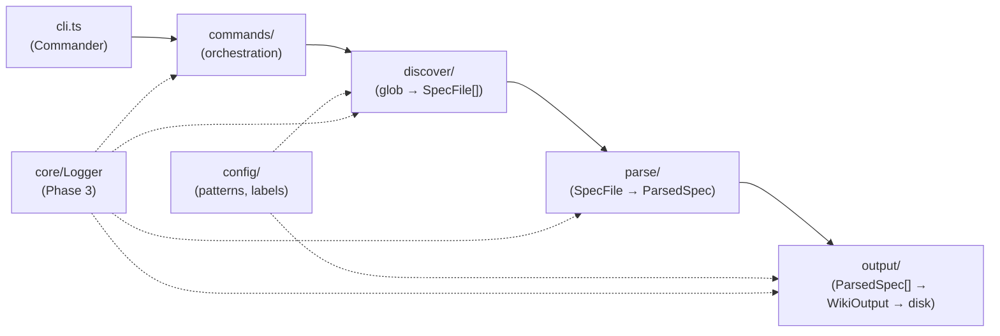
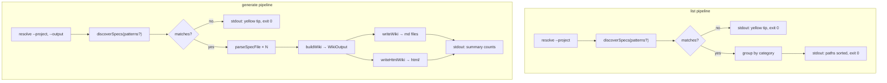

# Architecture Spine — specwiki

## Design Paradigm

**Pipes-and-filters** over a **layered module tree**. Each stage owns one transformation; commands orchestrate the pipeline without embedding domain logic. Data flows forward only — no module below `commands/` imports from sibling orchestrators.



| Layer | Owns | Must not own |
| ----- | ---- | ------------ |
| `cli.ts` | Commander wiring, option parsing, path.resolve on entry | Discovery, parsing, file writes |
| `commands/` | Pipeline orchestration, stdout summaries, exit behaviour | Glob rules, markdown transforms, HTML templates |
| `discover/` | Glob scan, category/title derivation, sort order | File reads, wiki layout |
| `parse/` | UTF-8 read, frontmatter, sections, description, marked render | Output paths, slug assignment |
| `output/` | Slug, page/index build, md/html write, escapeHtml | Glob patterns, CLI messaging |
| `config/` | `DEFAULT_SPEC_PATTERNS`, `CATEGORY_LABELS` | Runtime I/O |
| `types.ts` | Shared interfaces | Behaviour |
| `core/` *(Phase 3)* | Structured logger, verbose gate | Business logic |

## Invariants & Rules

### AD-1 — Module dependency direction [ADOPTED]

- **Binds:** all modules
- **Prevents:** circular imports, logic duplicated in CLI, config drift in commands
- **Rule:** Dependency flow is `cli → commands → {discover, parse, output} → config/types`. `discover`, `parse`, and `output` are siblings — they do not import each other. `parse` may export `renderMarkdown` consumed by `output`; `output` must not import discovery helpers. `config` and `types` are leaf modules with no upward imports.

### AD-2 — Frozen discovery patterns [ADOPTED]

- **Binds:** FR-001, NFR-013, `config/patterns.ts`
- **Prevents:** silent loss of framework coverage, breaking brownfield repos
- **Rule:** `DEFAULT_SPEC_PATTERNS` is **extend-only** — add globs via explicit HARNESS bullet; never remove or reorder without owner approval. `fast-glob` ignore list is fixed: `node_modules`, `dist`, `wiki`, `.specwiki`.

### AD-3 — Category and title derivation [ADOPTED]

- **Binds:** FR-002, `discover/specs.ts`
- **Prevents:** inconsistent grouping between `list` and `generate`, untested prefix regressions
- **Rule:** Category is prefix-based via `deriveCategory` — check order matters (most specific prefix first). Title via `deriveTitle` with basename special cases: `SKILL`, `AGENTS`, `SPEC`, `CLAUDE`, `GEMINI`. Results sorted by category then `relativePath` before leaving `discoverSpecs`.

### AD-4 — Wiki output layout contract [ADOPTED]

- **Binds:** FR-011, FR-012, FR-015, NFR-013
- **Prevents:** broken links, incompatible downstream SSG/manual browsing
- **Rule:** Resolved output dir contains `index.md`, `{slug}.md` per spec, and `html/index.html` + `html/{slug}.html`. Index groups by category using `CATEGORY_LABELS` sorted by label. Each page: title, source path blockquote, optional description, TOC from sections, raw markdown body unchanged.

### AD-5 — Slug derivation and collision safety

- **Binds:** FR-013, FR-014
- **Prevents:** silent overwrites when distinct paths map to identical slugs
- **Rule:** Slug = relative path → lowercase, `/` → `-`, strip `.md`/`.mdc`/`.txt`. **Brownfield gap:** collision disambiguation not yet implemented — Phase 3.4 must append path suffix or hash when slugs collide; until then, last-write-wins is a known bug.

### AD-6 — HTML title escaping [ADOPTED]

- **Binds:** FR-015, NFR-011, NFR-013
- **Prevents:** XSS via user-controlled titles in HTML wrapper
- **Rule:** `wrapHtml` MUST call `escapeHtml` on the page title in `<title>`. Body rendered via `marked.parse({ async: false })` from trusted local spec content — no additional sanitization in MVP.

### AD-7 — Path confinement on writes

- **Binds:** FR-019, FR-020, NFR-008, NFR-009
- **Prevents:** path traversal writing outside intended output directory
- **Rule:** Resolve `--project` and `--output` with `path.resolve`. All wiki writes land under `path.resolve(projectRoot, outputDir)`. Slug-derived filenames must reject or normalize `..` segments. **Brownfield gap:** explicit traversal guard tests required in Phase 2/3 hardening — verify before MVP sign-off.

### AD-8 — Parse-as-text only [ADOPTED]

- **Binds:** NFR-010, NFR-012
- **Prevents:** code execution from spec file contents, unexpected network I/O
- **Rule:** Discovered files are read as UTF-8 text and parsed with gray-matter/marked only. No `eval`, no dynamic import of spec paths, no network calls in MVP commands.

### AD-9 — Structured logging (Phase 3)

- **Binds:** FR-021, NFR-006, NFR-007
- **Prevents:** ad-hoc console noise, secret leakage in verbose mode
- **Rule:** Introduce `src/core/Logger.ts` — verbose-gated `log.info`/`log.error` with event names: `discover.start`, `discover.match`, `parse.file`, `output.write`, `cli.command`, `cli.error`. Errors log regardless of verbose. Payloads contain paths and counts, never full file bodies or secrets. **Brownfield gap:** verbose currently uses raw `console.log` in `commands/generate.ts` — replace in Phase 3.1–3.2.

### AD-10 — Quality gate on every task [ADOPTED]

- **Binds:** NFR-001, NFR-004, NFR-002
- **Prevents:** accumulating broken state across HARNESS bullets
- **Rule:** After each implementation task, run in order: `npm run test`, `lint`, `format`, `coverage`, `typecheck`, `build`. Coverage thresholds ≥ 90% lines/functions/branches/statements. TDD (Red → Green → Refactor) for all logic in `discover/`, `parse/`, `output/`, `config/`, `commands/`. No e2e/browser tests unless owner requests (NFR-005).

### AD-11 — Runtime dependency freeze [ADOPTED]

- **Binds:** NFR-014, NFR-015
- **Prevents:** dependency bloat, ESM/CJS friction
- **Rule:** Runtime deps limited to commander, fast-glob, gray-matter, marked, chalk. TypeScript 5.8 strict, Node ≥ 20, ESM with `.js` import extensions. New runtime deps require explicit justification.

## Consistency Conventions

| Concern | Convention |
| ------- | ---------- |
| Naming | camelCase functions; kebab-case test files; category keys kebab-case (`cursor-rules`); event names dot-separated (`discover.start`) |
| Data shapes | `SpecFile`, `ParsedSpec`, `WikiPage`, `WikiOutput` in `types.ts` — extend here before duplicating |
| Errors | Runtime failures exit non-zero; usage errors exit 2 [ASSUMPTION — not yet wired in v0.1] |
| Logging | Structured events to stderr via Logger; user summaries to stdout via chalk |
| Config | Patterns and labels in `config/patterns.ts` only until POST-MVP config loader |
| Tests | Mirror `src/` under `tests/`; fixtures in `tests/fixtures/sample-project/` |
| Coverage exclusions | `src/cli.ts`, `tests/**`, config files |

## Stack

| Name | Version |
| ---- | ------- |
| Node.js | ≥ 20 |
| TypeScript | 5.8.x strict |
| Commander | ^13.1.0 |
| fast-glob | ^3.3.3 |
| gray-matter | ^4.0.3 |
| marked | ^15.0.7 |
| chalk | ^5.4.1 |
| Vitest + @vitest/coverage-v8 | ^3.0.9 |

## Structural Seed

```text
specwiki/
├── src/
│   ├── cli.ts              # Commander entry (bin → dist/cli.js)
│   ├── types.ts            # Shared interfaces
│   ├── commands/
│   │   └── generate.ts     # generateWiki, listSpecs orchestration
│   ├── config/
│   │   └── patterns.ts     # DEFAULT_SPEC_PATTERNS, CATEGORY_LABELS
│   ├── discover/
│   │   └── specs.ts        # discoverSpecs, deriveCategory, deriveTitle
│   ├── parse/
│   │   └── markdown.ts     # parseSpecFile, extractSections, renderMarkdown
│   ├── output/
│   │   └── wiki.ts         # buildWiki, writeWiki, writeHtmlWiki, escapeHtml
│   └── core/               # Phase 3 — Logger.ts (not yet present)
├── tests/                  # Mirrors src/; fixtures/sample-project/
├── dist/                   # tsc output (gitignored)
└── wiki/                   # Generated output (gitignored)
```

## Data Flow — List vs Generate



| Stage | `list` | `generate` |
| ----- | ------ | ---------- |
| Discovery | ✓ | ✓ |
| Parse | — | ✓ |
| Build wiki | — | ✓ |
| Write disk | — | ✓ |
| `--verbose` | — | ✓ (diagnostics) |
| `--output` | ignored | ✓ |

Shared discovery ensures list preview matches generate input set for the same `--project`.

## Capability → Architecture Map

| Capability / FR | Lives in | Governed by | Brownfield status |
| --------------- | -------- | ----------- | ----------------- |
| FR-001 glob scan | `discover/specs.ts`, `config/patterns.ts` | AD-2, AD-3 | **Done** |
| FR-002 category/title | `discover/specs.ts` | AD-3 | **Done** |
| FR-003 list grouped output | `commands/generate.ts` (`listSpecs`) | AD-1 | **Done** |
| FR-004 zero-match tip | `commands/generate.ts` | AD-1 | **Partial** — generate has tip; list missing tip text |
| FR-007–FR-009 parse | `parse/markdown.ts` | AD-8 | **Done** |
| FR-011–FR-012 wiki md | `output/wiki.ts` | AD-4 | **Done** |
| FR-013 slug derivation | `output/wiki.ts` (`pageSlug`) | AD-5 | **Done** |
| FR-014 slug collisions | `output/wiki.ts` | AD-5 | **Not built** — Phase 3.4 |
| FR-015 HTML wiki | `output/wiki.ts` | AD-4, AD-6 | **Done** |
| FR-016 generate summary | `commands/generate.ts` | AD-1 | **Done** |
| FR-019–FR-021 CLI flags | `cli.ts`, `commands/generate.ts` | AD-7, AD-9 | **Done** (verbose unstructured) |
| FR-022 exit codes | `cli.ts` | AD-10 | **Partial** — no explicit code 2 |
| FR-030 IMPLEMENTATION.md | repo root | AD-10 | **Not built** — Phase 0.1 |
| FR-031 dogfood | operational | AD-4 | **Fixture-primary** — `tests/fixtures/sample-project/` (10 specs); repo root zero under current patterns (see decisions.md 2026-07-12) |
| NFR-001 coverage 90% | `vitest.config.ts`, `tests/` | AD-10 | **Done** (~99% lines) |
| NFR-006 structured logs | `core/Logger.ts` *(planned)* | AD-9 | **Not built** — Phase 3.1–3.2 |
| NFR-008–NFR-009 path safety | `output/wiki.ts`, `commands/` | AD-7 | **Verify** — tests needed |

## Brownfield Ratification

**Verdict:** v0.1 scaffold implements the full list → generate pipeline. MVP completion is **hardening and meta**, not greenfield architecture.

### Ratified (matches PRD + code)

- Module boundaries per AD-1 — seven source files, clear separation
- 15+ default glob patterns covering Cursor, OpenSpec, Kiro, Copilot, root agent files
- Category labels and prefix derivation tested (`tests/discover/specs.test.ts`)
- Markdown + HTML dual output with frozen layout
- `escapeHtml` on HTML titles
- Vitest suite across discover/parse/output/commands/config; 90% thresholds enforced
- Quality gate scripts present: test, lint, format, coverage, typecheck, build

### Requires building (HARNESS Phases 0–3 gaps)

| Gap | HARNESS ref | Target module | Priority |
| --- | ----------- | ------------- | -------- |
| `IMPLEMENTATION.md` build log | Phase 0.1 | repo meta | MVP blocker |
| `src/core/Logger.ts` + wiring | Phase 3.1–3.2 | `core/`, `commands/`, discover/parse/output | MVP blocker |
| Slug collision disambiguation | Phase 3.4 | `output/wiki.ts` | MVP blocker |
| Path traversal guard tests | Phase 2.5 / 3.5 | `output/wiki.ts` | MVP verify |
| `list` zero-match helpful tip | FR-004 | `commands/generate.ts` | MVP polish |
| Explicit exit code 2 for usage | FR-022 | `cli.ts` | MVP polish [ASSUMPTION] |

### POST-MVP extension points (design hooks, not MVP scope)

| Extension | Hook location | Precedence / behaviour |
| --------- | ------------- | ---------------------- |
| `--patterns` / `specwiki.config.js` | New `config/loader.ts`; pass `patterns` into `discoverSpecs` | CLI > env > project config > `DEFAULT_SPEC_PATTERNS` (FR-005) |
| `--json` stdout | `commands/` output formatters | Stable JSON schema alongside human text (FR-023) |
| `generate --check` | `output/` diff helper | Exit 1 if wiki stale (FR-024) |
| `generate --watch` | New `commands/watch.ts` + fs watcher | Debounced re-invoke generate pipeline (FR-025) |
| `specwiki serve` | New `commands/serve.ts` | Node `http` on `127.0.0.1` only; serves resolved `--output` (FR-026) |
| `wiki/llms.txt` | `output/llms.ts` | Category-indexed export from `ParsedSpec[]` (FR-017) |
| Semantic enrichment | `parse/enrich/` submodules | Framework-specific metadata without breaking raw-content contract (FR-010) |
| Plugins | `config/plugins.ts` | Custom category rules after config API stable |
| npm publish + CI | `package.json`, `.github/workflows/` | Phase 4.2–4.3 |

`DiscoverOptions.patterns` and `GenerateOptions.patterns` already exist in `types.ts` — config loader can inject without changing discover signature.

## Deferred

| Decision | Reason deferred | Revisit when |
| -------- | --------------- | ------------ |
| Config file format (JS vs JSON) | Zero-config MVP must prove default patterns first | Phase 4.1 / Epic B |
| JSON output schema versioning | No agent consumers until MVP stable | Epic A |
| Body HTML sanitization beyond title | Trusted local specs assumption | If `--allow-html` or untrusted input |
| Watch debounce interval | UX tuning | Epic B implementation |
| Plugin API surface | Premature before config stable | POST-MVP |
| SSG export scaffold | Users can point SSG at `wiki/` manually | Epic D |
| Semantic parsing (BMAD kernels, OpenSpec deltas) | MVP treats all inputs as markdown-with-frontmatter | Epic C |
| MCP manifest indexing | New discovery category | POST-MVP |
| Cross-repo scanning | Enterprise scope | Persona D |
