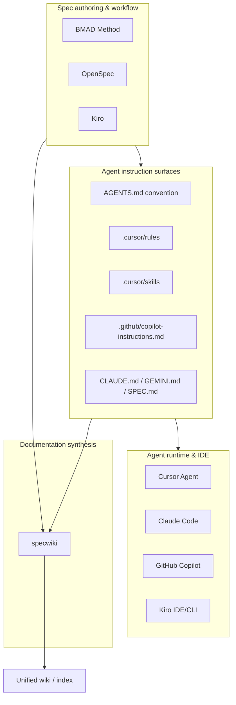
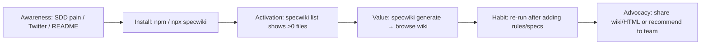

# Domain Research: Spec-Driven Development Ecosystem & specwiki Positioning

**Product:** specwiki — CLI that transforms AI agent specs and spec-driven development files into structured wiki documentation  
**Research date:** 2026-07-12  
**Research mode:** Headless discovery (no owner input)  
**Sources:** Project artifacts (`README.md`, `HARNESS.md`, `project-context.md`), ecosystem documentation, GitHub adoption signals, industry analysis (2025–2026)

---

## Executive Summary

Spec-driven development (SDD) has moved from niche methodology to mainstream practice as AI coding agents became default tooling for software teams and solo builders. Frameworks like BMAD, OpenSpec, and Kiro; IDE conventions like Cursor rules and skills; and cross-tool standards like AGENTS.md all produce **persistent markdown artifacts** scattered across repository trees. None of these tools solve the **readability and navigation problem** at scale: agents consume specs one file at a time, but humans need a unified, browsable view of what the project expects agents to know and do.

**specwiki** occupies a narrow but valuable niche: **documentation synthesis for agent instruction surfaces**. It does not compete with spec authoring (OpenSpec, Kiro), multi-agent orchestration (BMAD), or agent runtime (Cursor, Claude Code). It aggregates what already exists and emits a categorized wiki (markdown + HTML) from a single CLI command.

**MVP primary target persona:** **A) Solo developers using Cursor/AI agents** (see §9 for decision rationale).

**MVP boundary hypothesis:** specwiki wins when a single developer can run `specwiki generate` on their repo and immediately understand the full landscape of agent instructions—without configuring a docs platform, without team infrastructure, and without adopting another SDD framework.

---

## 1. Spec-Driven Development Ecosystem Overview

### 1.1 What SDD Means in 2026

Spec-driven development is the practice of treating **structured specifications as the source of truth** that AI agents implement against, rather than ephemeral chat prompts. The pattern emerged as a corrective to "vibe coding"—fast but inconsistent agent output when requirements live only in conversation history.

Common SDD principles across frameworks:

| Principle               | Description                                                                                          |
| ----------------------- | ---------------------------------------------------------------------------------------------------- |
| Spec before code        | Requirements, design, and tasks are written (or AI-drafted and human-approved) before implementation |
| Persistent artifacts    | Specs live in version control alongside code, surviving session boundaries                           |
| Agent-consumable format | Markdown, YAML frontmatter, structured sections—formats agents can read and humans can review        |
| Delta-oriented change   | Brownfield projects specify _what changes_, not re-document the entire system                        |

The ecosystem splits into three layers that specwiki spans but does not replace:



### 1.2 BMAD (Breakthrough Method for Agile AI-Driven Development)

**What it is:** Open-source (MIT), npm-installable framework (`npx bmad-method install`) that simulates an agile team through specialized AI agent personas (PM, Architect, Developer, UX Designer, Tech Writer, and others). Creates an `_bmad/` directory with skills, workflows, and configuration.

**Artifact footprint:** Planning outputs typically land in `_bmad-output/planning-artifacts/` (PRDs, architecture, epics, stories), `.agents/skills/` (BMad skills as `SKILL.md` files), and project-specific paths like `docs/specs/`, `docs/stories/`. V6 reorganized around a modular "skills architecture" with 34+ workflows.

**Relationship to specwiki:** BMAD is **orchestration-first, spec-by-outcome**. It produces many markdown files across phases but does not provide a unified human-readable index. specwiki's default patterns already scan `.agents/skills/**/SKILL.md`, `specs/**`, and `docs/plans/**`—directly relevant to BMAD-heavy repos.

**Adoption signal:** 40k+ GitHub stars (2026); widely cited in SDD comparisons alongside OpenSpec and Kiro.

### 1.3 OpenSpec

**What it is:** Lightweight, brownfield-first SDD framework (Fission-AI/OpenSpec). CLI (`openspec init`) plus slash commands (`/opsx:explore`, `/opsx:propose`, `/opsx:apply`, `/opsx:archive`) integrated with 30+ AI assistants.

**Artifact footprint:** `openspec/specs/` (capability-organized living specs), `openspec/changes/` (per-change folders with proposal, design, tasks, delta specs). Emphasizes **delta specs** (ADDED/MODIFIED/REMOVED requirements) rather than full rewrites.

**Relationship to specwiki:** OpenSpec owns the spec lifecycle; specwiki **reflects** it. specwiki's `openspec/**/*.{md,mdc}` pattern and dedicated "OpenSpec" category label map directly to this layout. OpenSpec's emerging "Stores" concept (cross-repo spec repos) is a POST-MVP integration opportunity for specwiki.

**Positioning contrast:** OpenSpec = agreement layer before code. specwiki = readability layer after specs exist.

### 1.4 Kiro (AWS)

**What it is:** Agentic IDE and CLI from AWS built around spec-driven development. Generates structured planning artifacts before autonomous implementation, with property-based testing and enterprise governance (IAM, SSO).

**Artifact footprint:** `.kiro/specs/{feature-name}/` containing `requirements.md`, `design.md`, and `tasks.md`. Steering rules (markdown) provide project context similar to Cursor rules. Spec format is shared across IDE and CLI surfaces.

**Relationship to specwiki:** Kiro users accumulate spec folders per feature; specwiki's `.kiro/specs/**/*.{md,mdc}` pattern and "Kiro Specs" category provide cross-feature navigation that Kiro's per-spec UI does not optimize for.

### 1.5 Cursor Rules & Skills

**Rules (`.cursor/rules/*.mdc`):** Scoped, version-controlled system instructions with YAML frontmatter (`alwaysApply`, `globs`, `description`). Replace legacy `.cursorrules`. Team/Enterprise plans add org-wide enforced rules.

**Skills (`.cursor/skills/**/SKILL.md`):** On-demand, invokable multi-step workflows (`/skill-name`). Loaded dynamically to save context tokens. Cursor 2.4+ includes migration from eligible rules to skills.

**Relationship to specwiki:** Cursor is the **dominant solo-dev agent surface** in this ecosystem. A typical active project accumulates 5–30 rule files and multiple skills. specwiki categorizes these as "Cursor Rules" and "Cursor Skills"—the two largest non-framework spec volumes in brownfield repos.

### 1.6 AGENTS.md Convention

**What it is:** Open, tool-agnostic markdown convention (agents.md) for project-level agent instructions—described as "README for agents." Backed by OpenAI Codex, Cursor, Google Jules, Amp, and 20+ tools. ~23k GitHub stars on the format repo (2026). Supports nested `AGENTS.md` in monorepos (closest file wins).

**Artifact footprint:** Root `AGENTS.md` plus nested copies; often coexists with tool-specific files (`CLAUDE.md`, `GEMINI.md`, `.github/copilot-instructions.md`).

**Relationship to specwiki:** AGENTS.md is the **lingua franca** layer. specwiki treats root agent files as first-class ("Project Root" category) and surfaces duplication across tool-specific files—a common pain when teams use multiple agents.

### 1.7 Ecosystem Comparison Matrix

| Dimension       | BMAD                                          | OpenSpec                                 | Kiro                            | Cursor rules/skills     | AGENTS.md                         | specwiki                         |
| --------------- | --------------------------------------------- | ---------------------------------------- | ------------------------------- | ----------------------- | --------------------------------- | -------------------------------- |
| Primary job     | Multi-agent agile workflow                    | Lightweight spec agreement               | Spec-first agentic IDE          | IDE agent customization | Cross-tool project context        | Unified wiki from existing specs |
| Spec authoring  | Yes (extensive)                               | Yes (core)                               | Yes (core)                      | No (constraints only)   | Minimal (pointers)                | No                               |
| Agent execution | Via skills/hooks                              | Via slash commands                       | Built-in IDE/CLI                | Built-in Cursor Agent   | Passive (loaded at session start) | No                               |
| Output location | `_bmad-output/`, `docs/`                      | `openspec/`                              | `.kiro/specs/`                  | `.cursor/`              | Repo root + nested                | `wiki/` (generated)              |
| Best for        | Complex projects needing full SDLC simulation | Brownfield teams wanting lightweight SDD | AWS/enterprise spec-first shops | Cursor-native workflows | Multi-tool portability            | Anyone with scattered agent docs |

---

## 2. Target User Personas

### Persona A: Solo Cursor/AI Agent Developer ("Alex")

- **Profile:** Individual developer, indie hacker, or senior IC using Cursor, Claude Code, or Copilot daily on 1–3 active repos.
- **Behavior:** Adopts BMAD or OpenSpec opportunistically; accumulates `.cursor/rules/`, skills, and root instruction files organically; rarely maintains formal docs.
- **Goal:** Understand "what did I tell the agents?" after weeks of iterative rule-writing; onboard themselves after context loss.
- **Success signal:** Runs `specwiki generate`, opens `wiki/index.md` or HTML, finds every instruction surface in one view.

### Persona B: Small Team Spec Adopter ("Jordan, Tech Lead")

- **Profile:** Tech lead at a 2–10 person startup standardizing on OpenSpec, BMAD, or internal spec conventions.
- **Behavior:** Introduces AGENTS.md, shared Cursor rules, and `specs/` directory; needs async review and onboarding for new hires.
- **Goal:** Single source of navigable truth for agent conventions; PR review of spec changes with human-readable diffs.
- **Success signal:** Wiki committed to repo or published; new teammate reads wiki before first agent session.

### Persona C: Open-Source Maintainer ("Sam")

- **Profile:** Maintainer of a library or framework with contributor-facing agent instructions.
- **Behavior:** Documents AGENTS.md, contribution specs, and CI agent configs; cares about external discoverability.
- **Goal:** Published, linkable documentation of agent conventions for contributors and downstream tool users.
- **Success signal:** Wiki linked from README; contributors find agent rules without spelunking `.cursor/`.

### Persona D: Enterprise Platform Engineer ("Riley")

- **Profile:** Platform/DevEx team at 50+ person org rolling out Cursor Team Rules and MCP governance.
- **Behavior:** Centralizes rules; needs audit trails and compliance documentation.
- **Goal:** Inventory and documentation of all agent instruction surfaces across monorepos.
- **Success signal:** Automated wiki generation in CI; dashboard of rule coverage.
- **MVP fit:** Poor — requires CI integration, multi-repo scanning, and auth (POST-MVP).

---

## 3. Pain Points specwiki Solves

### 3.1 Scattered Specs Across Directory Trees

A single brownfield repo commonly contains:

- Root: `AGENTS.md`, `CLAUDE.md`, `SPEC.md`
- Cursor: `.cursor/rules/*.mdc`, `.cursor/skills/*/SKILL.md`
- Framework: `openspec/`, `.kiro/specs/`, `_bmad-output/`, `specs/`
- GitHub: `.github/copilot-instructions.md`

No native tool aggregates these. Developers grep, rely on memory, or re-prompt agents to "list all rules." specwiki's 15+ default glob patterns address this directly.

### 3.2 No Unified Human-Readable View

Agents read files individually; humans need **navigation**. Framework UIs (Kiro spec browser, OpenSpec change folders, BMAD skill lists) are workflow-centric, not documentation-centric. specwiki produces:

- Categorized index (`wiki/index.md`)
- Per-spec pages with TOC, source path, and full content
- Optional HTML for browser reading

### 3.3 Onboarding Friction for Agent Conventions

New contributors (or future-you) face opaque `.cursor/rules/` trees and nested spec folders. A generated wiki reduces time-to-first-productive-agent-session from hours to minutes.

### 3.4 Cross-Tool Duplication Blindness

Teams using Cursor + Claude Code + Copilot often maintain near-duplicate instruction files. specwiki surfaces all variants in one index, making drift visible (even if it does not yet diff them—that is POST-MVP).

### 3.5 Documentation Debt from SDD Frameworks

BMAD and OpenSpec **produce** specs aggressively. The output volume grows faster than human maintenance. specwiki turns production artifacts into consumable docs with zero additional authoring.

### 3.6 What specwiki Does NOT Solve (MVP)

- Spec authoring, validation, or enforcement
- Agent execution or workflow orchestration
- Real-time sync when specs change (no watch mode in MVP)
- Cross-repo or team-shared spec stores
- Semantic search or AI Q&A over specs

---

## 4. Market & Category Positioning

### 4.1 Category Definition

specwiki sits at the intersection of three markets:

| Market                    | Analogues                              | specwiki angle                                       |
| ------------------------- | -------------------------------------- | ---------------------------------------------------- |
| **Developer tools (CLI)** | `typedoc`, `jsdoc`, `mkdocs`, `mdbook` | Doc generator, but source = agent specs not APIs     |
| **Documentation**         | Notion exports, GitBook, Docusaurus    | Zero-config, repo-local, no SaaS                     |
| **Agent infrastructure**  | AGENTS.md, Cursor rules ecosystem, MCP | Read-only synthesis layer; complements runtime tools |

### 4.2 Competitive Landscape

**Direct competitors:** None identified with identical scope (CLI wiki generator for agent instruction files). Closest adjacent tools:

- **Static site generators** (Docusaurus, MkDocs): Require manual nav config; not discovery-aware of SDD layouts.
- **OpenSpec / BMAD built-in views:** Workflow UIs, not cross-framework aggregators.
- **IDE rule browsers:** Cursor shows rules in settings; no cross-tool, exportable wiki.

**Indirect competitors:**

- Manual README curation (high friction, stale quickly)
- Custom scripts/globs (what specwiki replaces)
- Do nothing (agents still work; humans suffer)

### 4.3 Positioning Statement

> **For developers who use AI coding agents**, specwiki is a **CLI documentation synthesizer** that **discovers and unifies agent specs, rules, and skills into a browsable wiki**. Unlike SDD frameworks that _create_ specs or IDEs that _run_ agents, specwiki **makes existing agent instructions human-navigable** with one command.

### 4.4 Differentiation Pillars

1. **Framework-agnostic discovery** — BMAD, OpenSpec, Kiro, Cursor, AGENTS.md out of the box
2. **Zero SaaS** — Local CLI, markdown output, optional HTML; no account required
3. **Brownfield-native** — Scans what exists; no migration or init ceremony
4. **Agent-ecosystem aware** — Category labels and title derivation tuned for SKILL.md, AGENTS.md, etc.

---

## 5. Adoption Patterns & MVP Success Metrics

### 5.1 Expected Adoption Funnel (Persona A)



### 5.2 Adoption Patterns

| Pattern                   | Description                                                   | MVP support                                                             |
| ------------------------- | ------------------------------------------------------------- | ----------------------------------------------------------------------- |
| **Solo local generate**   | Dev runs CLI in project root, opens wiki in editor or browser | Full                                                                    |
| **Commit wiki to repo**   | Add `wiki/` or `.specwiki/` to git for team visibility        | Full (output dir configurable)                                          |
| **Pre-commit / CI hook**  | Regenerate wiki on spec changes                               | POST-MVP (Phase 4.3 CI workflow is package-level, not consumer CI docs) |
| **npm global install**    | `npm link` / `npx specwiki` in any project                    | MVP target (Phase 4.2 publish)                                          |
| **Monorepo nested specs** | Multiple AGENTS.md, package-level rules                       | Partial (discovery finds files; slug collision is known gap)            |

### 5.3 MVP Success Metrics

| Metric                       | Target                                                            | Measurement                                             |
| ---------------------------- | ----------------------------------------------------------------- | ------------------------------------------------------- |
| **Activation rate**          | ≥70% of installs run `generate` within first session              | npm download → GitHub issue/telemetry (POST-MVP)        |
| **Discovery yield**          | Median project finds ≥5 spec files                                | `specwiki list` output count on fixture + dogfood repos |
| **Time to first wiki**       | <60 seconds from clone to browsable output                        | CLI benchmark on specwiki repo itself                   |
| **Quality gate reliability** | 100% pass on `npm run test/lint/coverage/build`                   | CI (Phase 4.3)                                          |
| **Dogfood validation**       | specwiki repo generates complete wiki of its own specs            | Self-host test                                          |
| **Zero-config rate**         | ≥80% of BMAD/OpenSpec/Cursor sample repos need no custom patterns | Fixture coverage in `tests/fixtures/`                   |

### 5.4 Anti-Metrics (What Not to Optimize in MVP)

- Monthly active users / SaaS retention (no SaaS)
- Spec authoring engagement (not our job)
- Agent implementation quality (downstream of specs, not docs)

---

## 6. Ecosystem Trends (2025–2026)

### 6.1 Agent Instruction File Proliferation

Research on 10,000 GitHub repos (arxiv 2510.21413) documents rapid growth of context files: AGENTS.md, CLAUDE.md, copilot-instructions.md, GEMINI.md. OpenAI's main repo reportedly contains 88 nested AGENTS.md files. **Volume trend:** instruction surface area grows faster than human curation capacity—validating specwiki's synthesis value.

### 6.2 Layered Customization Model

Industry consensus (2026): three complementary layers, not competitors:

1. **AGENTS.md / rules** — ambient project context
2. **Skills** — invokable workflows on demand
3. **MCP** — live external data and tools

specwiki should eventually document MCP configs (`.cursor/mcp.json`) as discoverable metadata even if not full MCP introspection.

### 6.3 Skills Architecture Migration

BMAD V6, Cursor 2.4+ (`/migrate-to-skills`), and Claude Code skills converge on **SKILL.md as the portable workflow unit**. specwiki already prioritizes `SKILL.md` in title derivation—a trend-aligned design choice.

### 6.4 Spec-Driven Development Mainstreaming

SDD frameworks explicitly market against "vibe coding." Enterprise adoption (AWS Kiro, GMO engineering blog posts, life-sciences case studies) pushes specs from hobbyist pattern to expected practice. More specs → more need for human-readable aggregation.

### 6.5 Brownfield-First Tooling

OpenSpec and industry commentary emphasize mature codebases over greenfield. specwiki aligns: it scans existing trees without requiring `init` or framework adoption.

### 6.6 Cross-Tool Portability Pressure

AGENTS.md as open standard creates tension with tool-specific files. Teams maintain parallel instruction files until consolidation wins. specwiki benefits from this transition period by showing all surfaces at once.

### 6.7 MCP as Agent Infrastructure Standard

Model Context Protocol (Anthropic-origin, industry-adopted) standardizes tool/data access. MCP server configs proliferate in `.cursor/mcp.json` and similar paths. POST-MVP: discover and index MCP server declarations as wiki metadata.

---

## 7. POST-MVP Opportunities (Domain Lens)

| Opportunity                           | Domain rationale                                                                   | Dependency                       |
| ------------------------------------- | ---------------------------------------------------------------------------------- | -------------------------------- |
| **CI integration**                    | Teams want wiki regenerated on spec PRs; OSS maintainers want freshness guarantees | npm publish, stable CLI contract |
| **`--config` / custom patterns**      | Enterprise monorepos use non-standard paths                                        | Phase 4.1 in HARNESS             |
| **Watch mode**                        | Solo devs iterate rules frequently; manual re-run is friction                      | File watcher, debounce           |
| **Spec validation / drift detection** | Compare AGENTS.md vs CLAUDE.md; flag stale wiki                                    | Parsing + diff engine            |
| **Team sharing / publishing**         | Persona B needs hosted wiki or GitHub Pages export                                 | Static site export command       |
| **OpenSpec Stores integration**       | Cross-repo spec repos need cross-repo discovery                                    | OpenSpec Stores beta             |
| **Semantic search / AI Q&A**          | "What rules apply to auth?" over unified index                                     | Embeddings, optional LLM         |
| **Slug collision resolution**         | Monorepos hit duplicate slugs (known MVP gap)                                      | Phase 3.4                        |
| **MCP manifest indexing**             | Document which external tools agents can reach                                     | MCP schema parser                |
| **Plugins**                           | Custom category rules for org-specific layouts                                     | Extension API                    |
| **VS Code / Cursor extension**        | Open wiki panel from IDE                                                           | Editor API                       |
| **Diff-aware wiki**                   | Show what changed between generates                                                | Git integration                  |

Priority order by domain value × feasibility:

1. CI integration + npm publish (unlock team and OSS personas)
2. Custom patterns config (unlock monorepos)
3. Slug collision fix (quality blocker for large repos)
4. GitHub Pages / static export (OSS maintainer persona)
5. Watch mode (solo dev retention)

---

## 8. Ecosystem Map (Detailed)

```
spec-driven development ecosystem (2026)
═══════════════════════════════════════

AUTHORING LAYER          INSTRUCTION LAYER           RUNTIME LAYER
─────────────────        ───────────────────         ─────────────
BMAD Method              AGENTS.md (open std)        Cursor Agent
  └ _bmad/               CLAUDE.md / GEMINI.md       Claude Code
  └ _bmad-output/        .cursor/rules/*.mdc         GitHub Copilot
  └ .agents/skills/      .cursor/skills/SKILL.md     Kiro IDE/CLI
                         .github/copilot-instructions.md
OpenSpec                 llms.txt
  └ openspec/specs/
  └ openspec/changes/

Kiro
  └ .kiro/specs/*/

Generic
  └ specs/ docs/specs/ requirements/ docs/plans/

                         ┌─────────────────────┐
                         │      specwiki       │
                         │  discover → parse   │
                         │  → wiki (md/html)   │
                         └─────────────────────┘
                                    │
                                    ▼
                         wiki/index.md + pages
                         (human navigation layer)
```

---

## 9. MVP Primary Target Persona — Decision

### Decision: **A) Solo developers using Cursor/AI agents**

### Rationale

- **MVP capabilities match solo workflow.** The v0.1 scaffold is a local CLI (`list`, `generate`) with no authentication, team dashboards, hosted publishing, or cross-repo stores. Solo developers run one command on their machine and immediately get value—no coordination overhead.

- **Highest pain frequency.** Solo Cursor users are the fastest accumulators of scattered instruction files. A typical active project grows from 1 `AGENTS.md` to 10+ rules and multiple skills within weeks. The "what did I configure?" problem hits individuals first and most often.

- **Largest reachable market at launch.** Cursor's solo and indie adoption dwarfs structured team SDD rollouts. Persona A does not require org buy-in, team rule enforcement, or framework migration—only npm install and a repo with specs.

- **Shortest time-to-value validates the product.** Success metric "clone to browsable wiki in <60 seconds" is designed for one person at one laptop. Team and OSS personas add deployment, CI, and publishing steps that MVP deliberately excludes.

- **Natural expansion path without pivot.** Solo developers who adopt specwiki become tech leads (Persona B) and OSS maintainers (Persona C). They bring the tool to teams once CI integration and publishing exist—Persona A is the wedge, not the ceiling.

### Explicitly not MVP primary

| Persona             | Why deferred                                                                                 |
| ------------------- | -------------------------------------------------------------------------------------------- |
| B (Small teams)     | Needs CI regeneration, shared publishing, and onboarding docs workflow beyond local generate |
| C (OSS maintainers) | Needs stable npm package, GitHub Pages export, and README integration—not yet in MVP         |

---

## 10. MVP Boundary Hypothesis

### In scope (MVP proves)

- Discover 15+ default spec patterns across BMAD, OpenSpec, Kiro, Cursor, AGENTS.md, Copilot layouts
- Generate categorized markdown wiki + HTML subtree
- `list` command for discovery preview without write
- 90% test coverage, structured logging, path safety
- npm-installable CLI (`npx specwiki`)

### Out of scope (POST-MVP validates)

- Hosted wiki SaaS
- Spec authoring or AI-assisted editing
- Real-time watch/regenerate
- Cross-repo / OpenSpec Stores scanning
- Team admin, rule enforcement, or analytics
- Semantic search

### Hypothesis to falsify

> Solo developers with ≥5 agent instruction files will prefer `specwiki generate` over manually maintaining a specs index in README, and will re-run generate at least once after adding new Cursor rules or SDD artifacts.

**Falsification signals:**

- Users run `list`, see files, but never `generate` (discovery without value)
- Generated wiki is stale after first run (no re-run habit)
- Users request `--config` before basic generate works (monorepo mismatch dominates)
- Zero spec files found in majority of target repos (pattern coverage gap)

### Strategic moat (long-term)

Breadth of discovery patterns across SDD ecosystem + zero-config CLI. Moat deepens as new frameworks emerge (add patterns) and as instruction file volume grows (synthesis value increases). Weak moat if static site generators add agent-spec discovery plugins—speed of pattern updates and SDD community trust matter.

---

## 11. References

| Source                                    | URL                                          | Relevance                               |
| ----------------------------------------- | -------------------------------------------- | --------------------------------------- |
| BMAD Method (GitHub)                      | https://github.com/bmad-code-org/BMAD-METHOD | Framework artifacts, adoption           |
| OpenSpec                                  | https://openspec.dev/                        | SDD workflow, artifact layout           |
| OpenSpec GitHub                           | https://github.com/Fission-AI/OpenSpec       | Delta specs, Stores concept             |
| Kiro                                      | https://kiro.dev/                            | `.kiro/specs/` structure                |
| AGENTS.md                                 | https://agents.md/                           | Cross-tool convention                   |
| AGENTS.md GitHub                          | https://github.com/agentsmd/agents.md        | Format adoption                         |
| Cursor Rules docs                         | https://cursor.com/docs/rules                | Rules/skills model                      |
| Context Engineering for AI Agents (arxiv) | https://arxiv.org/html/2510.21413v4          | Instruction file proliferation research |
| specwiki README                           | `/README.md`                                 | Product scope, patterns                 |
| specwiki HARNESS                          | `/HARNESS.md`                                | MVP phases, frozen contracts            |
| project-context                           | `discovery/project-context.md`               | Implementation state                    |

---

## 12. Research Conclusions for Downstream Artifacts

| Downstream step | Carry-forward                                                                |
| --------------- | ---------------------------------------------------------------------------- |
| Product brief   | Lead with Persona A pain; position as synthesis not authoring                |
| PRD             | MVP features = list + generate + patterns; defer team/CI to POST-MVP roadmap |
| Architecture    | Discovery module is core IP; optimize pattern extensibility                  |
| Epics           | Phase 4 publish/CI enables Persona B/C expansion                             |
| Readiness       | Dogfood wiki on specwiki repo; validate against BMAD fixture tree            |

**Decision logged for discovery:** MVP primary persona = **A) Solo developers using Cursor/AI agents**.
