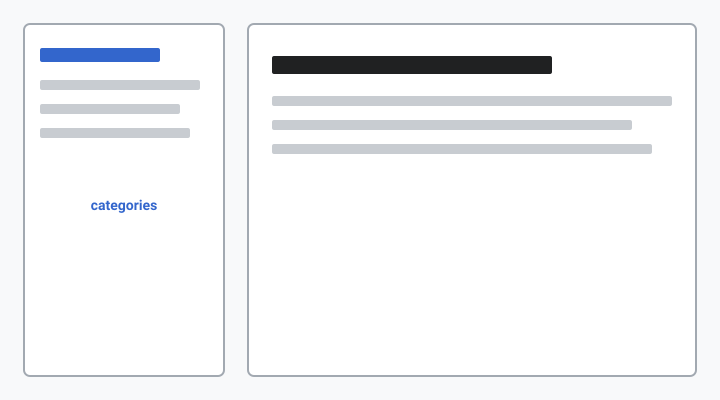

If you have spent an afternoon grepping for `AGENTS.md`, `.cursor/rules`, and `_bmad-output/**`, you already know the problem: AI-era projects accumulate knowledge faster than humans can browse it.

**specwiki** turns those scattered specs into a wiki with one command. That output belongs to _your_ repo — categorized pages, search, HTML you can open locally.

This blog is different. It is **publisher voice** at [specwiki.ai/blog](https://specwiki.ai/blog/):

- **Field Notes** — workflow pain and “should I try this today?” moments
- **Release Stories** — what changed and why (with links to the CHANGELOG, not a duplicate install guide)
- **Ecosystem** — where specwiki sits next to BMAD, Cursor rules, and the rest of the SDD stack

No comments widget, no RSS in v1, no analytics — just markdown in a PR, reviewed like any other change. If you want the reference docs, start with the [README](https://github.com/lucasviola/specwiki). If you want the “why now” story, stay here.
