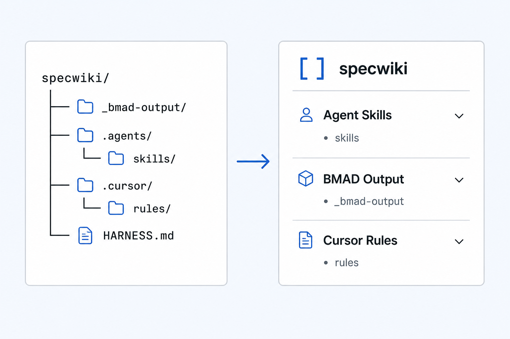
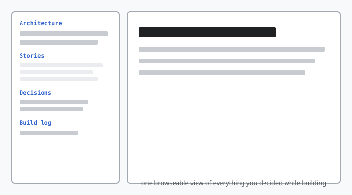

Shipping a feature feels clear in the moment. A week later, the picture gets fuzzy.

You remember the code you merged. You are less sure which architecture decision still applies, whether that ADR was superseded, or where the story file lives that defines the acceptance criteria you shipped against. The specs were written — they are in the repo somewhere — but they are spread across folders, filenames, and half-forgotten PR threads.

We built **specwiki** to fix that readability gap. Then we made using it part of how we close every feature.

Build, write specs, generate a wiki, read and understand — repeat after every feature

## The habit: generate at the end

Our ritual is simple. When a feature lands — code merged, tests green, story marked done — we point specwiki at the project root:

```bash
npm run dev generate -- --project . --output /tmp/specwiki-self
npm run dev open -- --project . --output /tmp/specwiki-self
```

Two commands. A static wiki opens in the browser: categorized pages, search, links between related specs. No dev server, no CMS, no copy-paste into a docs site.

We do this on the **specwiki repo itself** — the same tree where we write architecture notes, story files, ADRs, agent skills, and build logs. On a recent run, discovery found **341 markdown specs** grouped into architecture, implementation stories, decisions, skills, and project docs.

That number is not the point. The point is that after generate, we can **browse** what we built instead of **grep** for it.



## What we actually look at

Generating the wiki is not ceremony. It answers concrete questions that come up at the end of every slice of work:

**Did we document the decision?** Architecture decisions live in `docs/adr/`. After generate, they appear as linked pages in the wiki — not buried three directories deep. When someone asks “why did we choose markdown-in-repo over a CMS?”, the answer is one search away.

**Does the story match what shipped?** Implementation artifacts describe scope, acceptance criteria, and demo paths. Reading them in wiki form — next to the architecture spine and the build log — makes gaps obvious. Did we update the doc when scope shifted? Is the build log current?

**Can a new session pick up context fast?** Whether the next contributor is a teammate or an AI agent, pasting ten file paths into chat is fragile. A generated index with working links is durable. Search beats `@`-mention archaeology.



Specwiki does not write any of this. It **discovers and synthesizes** markdown that already lives in git — README files, ADRs, story specs, rules, research notes — into something you can read like documentation. The source of truth stays in the repo. The wiki is a view you regenerate whenever the repo changes.

## Why dogfood on our own product

Building specwiki while using specwiki sounds cute. In practice it is a stress test.

If discovery misses a folder we care about, we feel it immediately — because we needed that page after the last merge. If navigation grouping makes 300+ pages hard to scan, we fix it before asking anyone else to try. If generate is slow or the HTML is awkward to read, we notice because we run it weekly, not once at launch.

The repo became the benchmark: real volume, real folder chaos, real “where did we put that?” moments. The tool had to work here first.

That is the dogfooding loop in one sentence: **build the feature, regenerate the wiki, read back what you decided.** The specs were always in git. We just stopped treating “find the spec” as a separate task from “understand the feature.”

## Honest limits

A few things worth saying plainly:

- **specwiki reads; it does not author.** You still write specs in markdown. The wiki is output, not an editing surface.
- **341 pages is a maintainer view.** New contributors should still start with the [README](https://github.com/lucasviola/specwiki). The wiki helps once you are inside the project, not before.
- **Your repo may look different.** Discovery patterns are configurable. Ours picks up story folders, skills, ADRs, and README files — yours might not until you tune it.

None of that diminishes the habit. After every feature, spending five minutes in a regenerated wiki beats spending an hour reconstructing context from memory.

## Try the loop

If your project already accumulates specs in git — stories, ADRs, agent instructions, planning docs — the workflow is the same:

```bash
npx @lucasviola/specwiki generate --project .
npx @lucasviola/specwiki open --project .
```

Ship something. Generate. Read back what you decided.

We built specwiki to make that loop fast. We keep using it because it still works.
